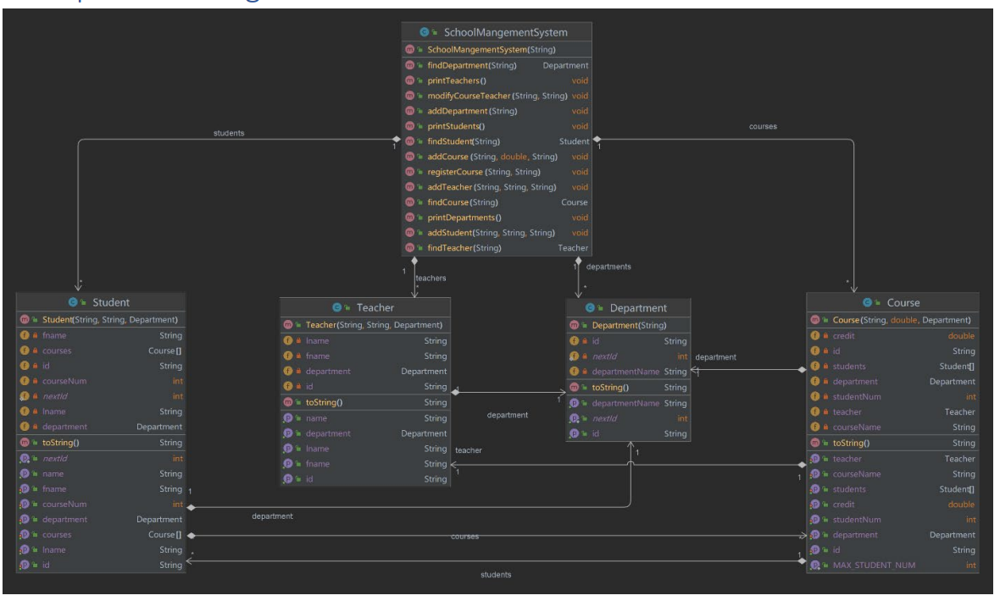

# SchoolManagementSystem

Final project for 'Intro to Programming' which consists of creating a program that can manage Students, Teachers, Courses and their Departments.

This project used the following knowledge points:
- Object Oriented Programming 
- Selection Structures
- Loop Structures
- Arrays

## Class Diagram

